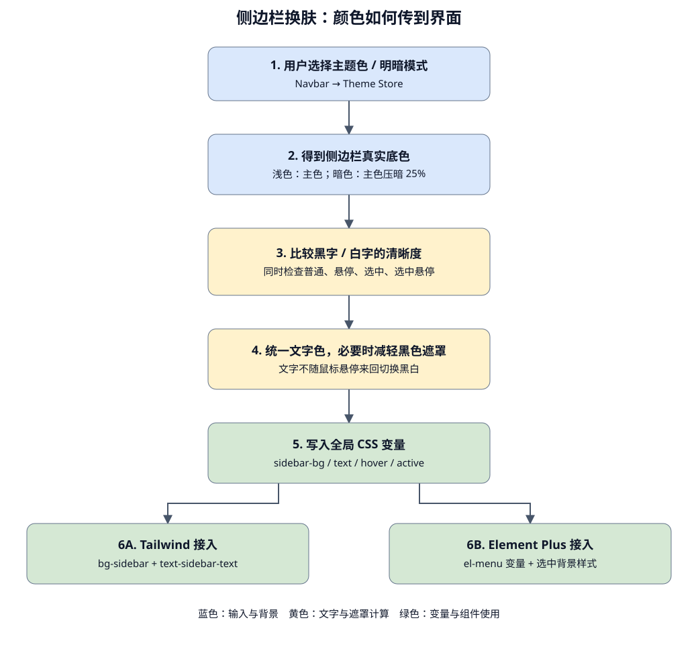

# 侧边栏换肤：从颜色选择到菜单显示

本项目有两种独立选择：主题色（蓝、绿、黄等）和明暗模式。侧边栏同时响应这两个选择。



## 1. 先认识三层名字

以侧边栏背景为例：

```text
--app-sidebar-bg             真正存放颜色的 CSS 变量
--color-sidebar              Tailwind 的颜色名称映射
bg-sidebar                  模板里使用的背景颜色工具类
```

变量像一个有名字的颜色盒子。`background-color: var(--app-sidebar-bg)` 就是从盒子里取出颜色并涂到背景上。

`@theme inline` 把这个盒子告诉 Tailwind，让它提供 `bg-sidebar` 这样的工具类。它不会负责计算黑字或白字。

Element Plus 有自己的颜色盒子，因此还需要把 `--el-menu-*` 接到我们的 `--app-sidebar-*` 上。

## 2. 谁负责计算，谁负责显示

1. Navbar 调用 Theme Store 的 `setPrimaryColor()` 或 `toggleTheme()`。
2. Store 的 `watch` 观察主题色和明暗模式，并调用 `getSidebarPalette()`。
3. 浅色模式使用主色作为侧栏背景；暗色模式把主色压暗 25%。
4. 计算黑字、白字在普通、悬停、选中、选中再悬停四种背景上的对比度。
5. 选择最差状态下仍然更清晰的文字色，所有菜单状态共用它。
6. 如果两种文字都无法在默认遮罩下保持 4.5:1，改用底色上的最佳文字，并逐步减轻黑色遮罩。
7. Store 把结果写到 html 的 CSS 变量上。菜单通过 CSS 自动跟随，无须在每个组件中再写 watch。

4.5:1 是这里用于普通文字的对比度目标。数字越大，文字和背景通常越容易区分。计算使用相对亮度，而不是只看颜色的 RGB 数值是否大于某个阈值。

## 3. 为什么透明黑色能实现悬停

菜单默认透明，下面是整个侧栏的主题色背景。悬停时，菜单项的背景变成 `rgb(0 0 0 / 10%)`。

这表示“10% 黑色 + 90% 原背景”，所以蓝色会变成深一点的蓝色，而不是换成白色。

默认遮罩：悬停 10%、选中 20%、选中再悬停 26%。它们是三个替换使用的背景，不是相互叠加的三层。特殊主题色会自动降低这组透明度。

遮罩只作用于背景，不使用 `opacity` 属性，因为 `opacity` 会连文字和图标一起变透明。

选中项使用更深的遮罩和加粗文字，不显示左侧装饰条。纯黑底色叠加黑色无法产生色差，此时主要依靠加粗文字识别选中项。

## 4. 各变量的使用场景

| 变量                         | 场景                         | 常用属性或工具类                                     |
| ---------------------------- | ---------------------------- | ---------------------------------------------------- |
| `--app-primary`              | 主色按钮、品牌强调背景       | `background-color` / `bg-primary`                    |
| `--app-on-primary`           | 直接位于原始主色背景上的文字 | `color` / `text-on-primary`                          |
| `--app-surface`              | 内容卡片、顶部导航背景       | `background-color` / `bg-surface`                    |
| `--app-text`                 | 内容区域主要文字             | `color` / `text-foreground`                          |
| `--app-text-secondary`       | 内容区域说明、日期           | `color` / `text-muted`                               |
| `--app-border`               | 内容区域边框                 | `border-color` / `border-border`                     |
| `--app-sidebar-bg`           | 整个侧边栏背景               | `background-color` / `bg-sidebar`                    |
| `--app-sidebar-text`         | 侧栏文字、图标、选中标记     | `color` / `text-sidebar-text`                        |
| `--app-sidebar-hover`        | 侧栏悬停背景遮罩             | `background-color` / `hover:bg-sidebar-hover`        |
| `--app-sidebar-active`       | 侧栏选中背景遮罩             | `background-color` / `bg-sidebar-active`             |
| `--app-sidebar-active-hover` | 已选中项的悬停背景遮罩       | `background-color` / `hover:bg-sidebar-active-hover` |

`surface` 随明暗模式变成白色或深灰色；主题色选择不改变它。侧栏通过自己的变量拥有更强的主题色表现。

`on-primary` 和 `sidebar-text` 可能不同：暗色侧栏已经压暗，还存在交互遮罩，因此不能直接把原始主色的对比文字照搬过去。

## 5. 代码中如何使用

### 普通 Tailwind 组件

```vue
<aside class="bg-sidebar text-sidebar-text">
  <button class="w-full hover:bg-sidebar-hover">
    普通导航
  </button>
  <button class="w-full bg-sidebar-active hover:bg-sidebar-active-hover font-semibold">
    当前导航
  </button>
</aside>
```

透明遮罩类应放在有侧栏底色的父元素内部；如果放到白色卡片里，得到的就是变暗的白色。

### 普通 CSS

```css
.sidebar {
  background-color: var(--app-sidebar-bg);
  color: var(--app-sidebar-text);
}
.sidebar-item:hover {
  background-color: var(--app-sidebar-hover);
}
```

### Element Plus 菜单

```css
.sidebar-menu {
  --el-menu-bg-color: transparent;
  --el-menu-text-color: var(--app-sidebar-text);
  --el-menu-active-color: var(--app-sidebar-text);
  --el-menu-hover-bg-color: var(--app-sidebar-hover);
}
.sidebar-menu :deep(.el-menu-item.is-active) {
  background-color: var(--app-sidebar-active);
}
```

实际组件给普通菜单项和子菜单标题设置 `:hover` 背景，颜色来自 `--app-sidebar-hover`。透明黑色背景本身就能形成遮罩效果，不需要额外的伪元素。选中项悬停使用更深的 `--app-sidebar-active-hover`。

`--el-menu-active-color` 设置的是选中文字颜色，选中背景需要单独设置。`scoped` 样式里的 `:deep()` 可以选到 Element Plus 内部生成的元素。

图标和展开箭头继承菜单文字颜色。不要给它们单独固定灰色或主题色，否则会破坏统一的对比色。

## 6. 从哪些文件读起

- `src/layout/components/Siderbar/sidebarMenu.vue`：先看最终使用方式。
- `src/assets/main.css`：看 Tailwind 名字如何映射到 CSS 变量。
- `src/stores/theme.ts`：看选择颜色后如何更新全局变量。
- `src/utils/themeColors.ts`：看背景、文字、遮罩的计算。
- `src/style/variables.scss`：默认值和页面其他区域的颜色。
- `index.html`：启动时恢复保存的主色和侧栏底色、文字；Store 在挂载前完成最终交互状态计算。

当前菜单是演示菜单，初始选中 `4`，方便直接查看选中效果。接入真实页面时，把菜单 index 和 default-active 对应到路由；这次没有把演示菜单改成路由菜单。
